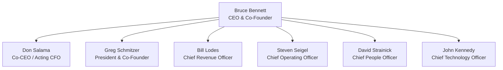
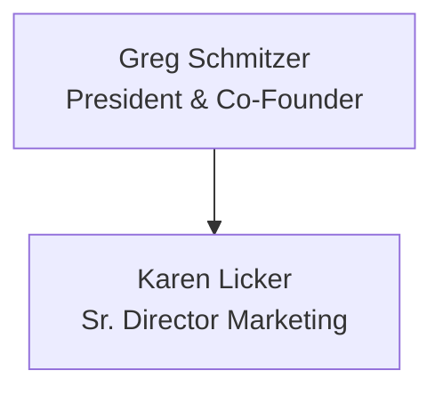
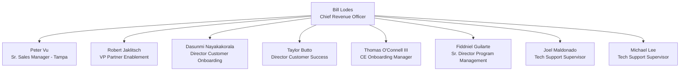
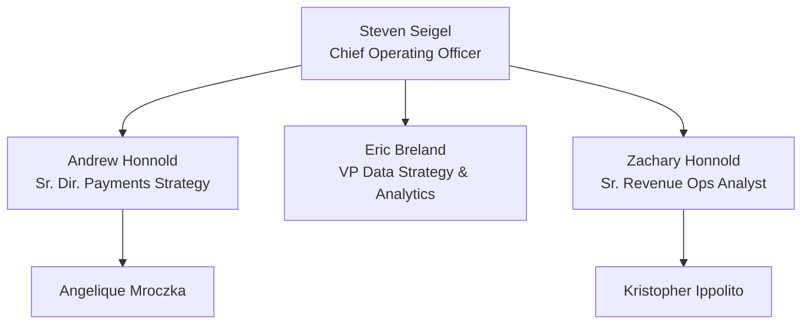
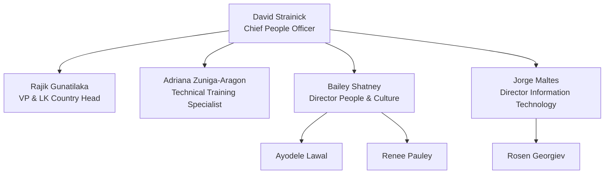
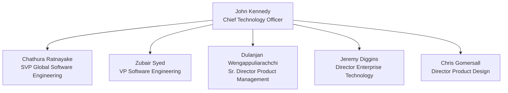

# Mad Mobile, Inc. Organizational Chart

**Executive Leadership & Reporting Structure — Three Layers**  
**March 2026**  
**CONFIDENTIAL**

---

## Executive Leadership (L1 Reporting Structure)

### Notes
- Don Salama was appointed Co-CEO.
- Don Salama operates as a **1099 consultant via Turn 3 Ventures** and is **not a W-2 employee**.

---

## Don Salama — Co-CEO & Acting CFO

### Role Structure
Don Salama serves as **Co-CEO and Acting CFO**. He operates as a **1099 consultant via Turn 3 Ventures** and is **not a W-2 employee of Mad Mobile**. As a result, he does **not** appear in the W-2 headcount system and has **no direct reports captured in payroll data**.

### Responsibilities
- Co-CEO strategic oversight alongside Bruce Bennett
- M&A execution
- Lender relationships (**WAB**, **Morgan Stanley**)
- Financial reporting
- Capital structure management
- Board advisory

---

## Greg Schmitzer — President & Co-Founder

### Direct Reports
- **Karen Licker** — Sr. Director Marketing

---

## Bill Lodes — Chief Revenue Officer

### Direct Reports and Teams

#### Peter Vu — Sr. Sales Manager - Tampa
- Timothy McNamara
- Mark Messerian
- Connor Phillips

#### Robert Jaklitsch — VP Partner Enablement
- Brett Gravlin
- Brett Matherne
- Thomas Brady
- Justin Hintz
- Tyler Kendrick
- Ever Contreras
- Alexander Kohnen
- Favian Aveja Galindo

#### Dasunmi Nayakakorala — Director Customer Onboarding
- Alexis Maltes
- Emily Stineman

#### Taylor Butto — Director Customer Success
- Robert Brisson
- Cynthia Petersen
- Megan Messmore
- Emily Batts
- Samantha Albert
- Trisha Baud
- Abigail Bernstein
- Adam Veliz
- Angel De Armas

#### Thomas O'Connell III — CE Onboarding Manager
- Edward Piper

#### Fiddniel Guilarte — Sr. Director Program Management
- Vanessa Sotomayor
- Qaiser Pannu
- Debbie Keye
- Ian Bennett

#### Joel Maldonado — Tech Support Supervisor
- Jassiel Alvarez
- Cameron Yelverton
- Kate Brooks
- Daniel Leniz
- Isaac Kim
- Christian Orellana
- Nicholas Allen
- David Morales

#### Michael Lee — Tech Support Supervisor
- Keith Burgess
- Francina Golden
- Zachary McCoy
- Kevin O'Haugherty
- Sanchana Samath
- Johnathan Tait
- Kiel Williams

---

## Steven Seigel — Chief Operating Officer

### Direct Reports and Teams

#### Andrew Honnold — Sr. Dir. Payments Strategy
- Angelique Mroczka

#### Eric Breland — VP Data Strategy & Analytics
- No additional team members shown in the source slides.

#### Zachary Honnold — Sr. Revenue Ops Analyst
- Kristopher Ippolito

---

## David Strainick — Chief People Officer

### Direct Reports and Teams

#### Rajik Gunatilaka — VP & LK Country Head
- No additional team members shown in the source slides.

#### Adriana Zuniga-Aragon — Technical Training Specialist
- No additional team members shown in the source slides.

#### Bailey Shatney — Director People & Culture
- Ayodele Lawal
- Renee Pauley

#### Jorge Maltes — Director Information Technology
- Rosen Georgiev

---

## John Kennedy — Chief Technology Officer

### Direct Reports and Teams

#### Chathura Ratnayake — SVP Global Software Engineering
- Akshay Bhasin
- Matthew Crumley
- Randall Brown

#### Zubair Syed — VP Software Engineering
- Daniel Lomsak
- Matias Riglos
- James Oliver
- Anthony Goad
- Ana Chambers
- Nagaswaroopa Kaukuri

#### Dulanjan Wengappuliarachchi — Sr. Director Product Management
- Mirunaaliny Somasunthara Iyer
- Thaddeus Fox
- Richard Farber

#### Jeremy Diggins — Director Enterprise Technology
- No additional team members shown in the source slides.

#### Chris Gomersall — Director Product Design
- No additional team members shown in the source slides.

---

## Source Notes
This markdown file is a text-based replacement of the source PDF slides. Where slides visually implied team hierarchy without additional descriptive text, the hierarchy has been represented using Mermaid diagrams and sectioned bullet lists.
